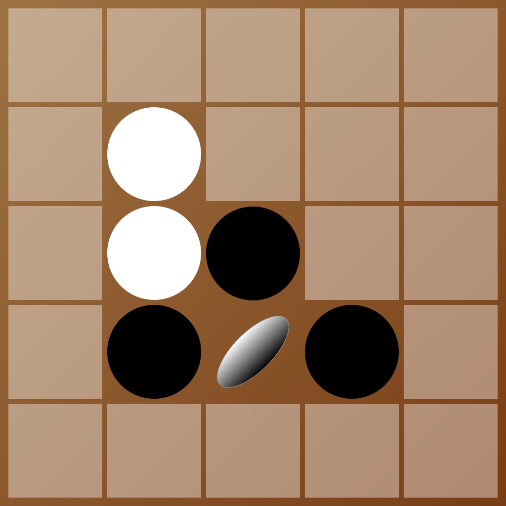

<p align="center">
  
</p>

<h1 align="center">Classic Reversi (Othello)</h1>

<p align="center">
  A clean, classic Reversi/Othello game built with Flutter for iOS and Android.
</p>

<p align="center">
  <a href="https://apps.apple.com/us/app/classic-reversi-othello-game/id1616580829">
    
  </a>
</p>

## Features

- **Three difficulty levels** — Easy (random legal moves), Medium (greedy heuristic), and Hard (minimax search), so both beginners and experienced players get a fair game.
- **Choose who goes first** — play as Black, let the computer open, or leave it to chance.
- **Local 2-player mode** — pass-and-play against a friend on the same device.
- **Undo** — take back your last move (once per turn, disabled on Hard).
- **Legal move hints** — on Easy difficulty, valid moves are marked on the board to help new players learn the rules.
- **Win/loss tracking** — your record is kept across sessions and shown on the start screen.
- Responsive board that adapts to any phone or tablet screen size.

## Tech stack

- [Flutter](https://flutter.dev) / Dart
- Minimax search with a positional heuristic for the CPU opponent (see `lib/move_finder.dart`, `lib/game_board_scorer.dart`)
- `google_mobile_ads` for banner/app-open ads
- `shared_preferences` for local persistence (difficulty, first-player choice, win/loss record)
- `in_app_review` for store review prompts

## Getting started

```bash
git clone https://github.com/banghuazhao/classic_reversi.git
cd classic_reversi
flutter pub get
flutter run
```

Run the test suite with:

```bash
flutter test
```

## Project structure

```
lib/
├── main.dart              # App entry point, navigation, game screen
├── start_screen.dart       # Difficulty / first-player / 2-player setup screen
├── game_model.dart         # Immutable game state (board + whose turn)
├── game_board.dart         # Board representation, legal move & flip logic
├── game_board_scorer.dart  # Positional heuristic used by the AI
├── move_finder.dart        # Minimax search / difficulty-based move selection
├── game_settings.dart      # Difficulty / first-player enums
├── settings_service.dart   # Persisted settings & win/loss record
├── styling.dart            # Shared colors, gradients, and text styles
└── Tools/                  # Ads and in-app review helpers
```

## Contributing

Issues and pull requests are welcome.
